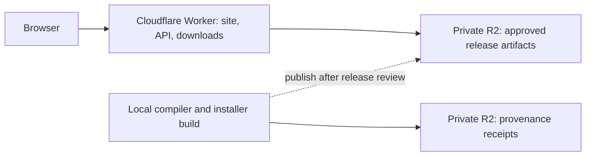

# rikwow.com infrastructure

Provisioned 2026-09-27 using the Cloudflare MCP connection.

## Domain and services

- **rikwow.com** registered through Cloudflare for **$10.46 USD** for one year.
  Current renewal quote: $10.46; future pricing can change.
- Registration expires **2027-09-27 18:21:17 UTC**.
  **Automatic renewal is disabled**. WHOIS contact redaction is enabled.
- Zone is active. DNSSEC was requested and remained pending at final review;
  recheck its status in Cloudflare.
- [Website](https://rikwow.com/), [release API](https://api.rikwow.com/api/v1/releases)
  and `downloads.rikwow.com` use Worker custom domains.
  `www.rikwow.com` redirects permanently to the apex.
- Worker: `rik-wow-site`; recovery address:
  https://rik-wow-site.olsonsoftware.workers.dev/.
- R2 buckets: `rik-wow-releases` and `rik-wow-sources`, Standard storage in WNAM.
  Both have public r2.dev access disabled.

## Architecture



One Worker serves the website, canonical generated guides, a same-origin Setup Studio editor and versioned release catalog. Studio executes the shared validated addon Lua pack contract and composes reviewed authentic component bitmaps; it never executes imported Lua or serves client source/data. Metadata changes do not require a game rerender. The [website design
notes](website-design.md) record the research and addon-specific visual direction. It binds the releases bucket and a Workers Static Assets service for the selected game screenshot. The source bucket has no
public route or Worker binding. No database, queue or always-on server is
needed for the current workload. Add D1 for collaborative fact review only
when there is an actual write workflow; static provider snapshots belong in R2.

The checked-in catalog is the exact download allowlist. Unknown keys receive
404 before storage access. Approved objects must match catalog size and SHA-256
metadata. Downloads stream from R2, support byte ranges, ETags and HEAD, and use
conditional reads to reject an object changed after its metadata check.
Release keys must be immutable and contain a version or content hash.
Immutable artifact responses use `Cache-Control: no-transform` so CDN
compression cannot weaken their byte validators or remove exact lengths.
See [Cloudflare content compression](https://developers.cloudflare.com/speed/optimization/content/compression/). SHA-256
metadata is an upload assertion; the release process must calculate it from
the actual artifact and clients must verify downloaded bytes.

The API reports the honest beta `prerelease` channel and the current addon version from `web/releases.mjs`. Direct installation links point to verified GitHub Releases. Windows setup contains licensed build dependencies and the interface. It obtains provider inputs separately and generates supported quest guidance and navigation locally; imported provider datasets and client geometry are absent from public artifacts. The acquisition and private-data boundary are documented in [the distribution plan](quest-navigation-acquisition.md). Studio and gallery share validated settings through bounded fragment links and a maintained submission workflow; there is no arbitrary public upload endpoint.

## Operate and deploy

Source and Wrangler configuration are in `web/`. Cloudflare account and zone
IDs are identifiers, not credentials. Secrets must stay in Wrangler secrets,
a scoped CI secret, or the connected Cloudflare account.

```powershell
cd web
npm ci
npm test
npm run check
npx wrangler login
npm run deploy
```

The production deployment was made through authenticated Cloudflare MCP
multipart Worker upload, using the same checked-in modules and configuration.
The game screenshot is uploaded through the documented Workers asset manifest and base64 multipart API; its completion token is attached to the Worker deployment. Future MCP code-only uploads must set `keep_assets: true` and retain the `ASSETS` binding. Wrangler deploys use `web/public` automatically. The Worker serves the reviewed public asset allowlist with cache validation and security headers; private renderer inputs and client files have no public routes.
The initial local Wrangler login had expired; subsequent reviewed deployments use authenticated Wrangler and `web/public` through the existing `npm run deploy` workflow. Its predeploy step checks capture provenance and generates docs/Studio. CI verifies source and bundle generation; automatic deployment is not configured. Verify the deployment identifier, live editor/gallery, guide source/output hashes, installation links and actual release bytes before recording success.

Before adding a release, verify the downloaded setup with
`python -B tools/verify_public_setup.py --directory <download-folder> --version <version> --proof <new-proof-folder>`.
Then run `node web/publish-release.mjs --directory <download-folder> --proof <new-proof-folder>/evidence.json --version <version> --output <new-storage-receipt>`.
The publisher uses the documented Wrangler platform proxy with an explicitly remote binding to the existing release bucket. It accepts only the program, manifest, checksums and notices, creates immutable keys conditionally, sets SHA-256 metadata, and reads back every byte. `--check-only` performs read-only preflight. Matching authored source is available at the annotated GitHub release tag; separately acquired datasets are excluded.
Add reviewed catalog entries from the storage receipt with path, key, bytes, sha256, filename and contentType.
Run `node web/verify-published.mjs --origin https://rikwow.com --output <new-proof-directory>` to download and hash all four approved setup artifacts, compare the live catalog and installation pages, and verify HEAD, byte ranges and conditional responses. The receipt retains the actual downloads and their digests. Verify those downloaded executable bytes again with `tools/verify_public_setup.py` before installation evidence is finalized. For a bad release,
remove its catalog entry and redeploy; preserve artifacts for diagnosis.
Roll back website code by deploying the preceding reviewed commit.

Verification includes Node request/storage tests, Playwright browser checks
at five viewport widths, Wrangler dry run, live HTTPS checks and reviewed
desktop/mobile screenshots. Logging samples 10% of Worker
requests and emits sanitized structured errors. Response headers restrict scripts to the same origin and block framing and
unneeded browser permissions. CPU limit is 10 ms per request.
Domain cost does not include future metered Worker/R2 usage; no additional
paid product subscription was purchased.

## Acquisition storage

The following storage receipts are historical research evidence and are not current Forever inputs. Current setup obtains QuestieDB and current client/schema inputs separately; it does not substitute this emulator dataset.

The historical independent provider was built locally under `dist/cmangos-provider-1/`.
The private sources bucket is intended for reproducible input manifests,
comparison reports and licensed source archives. Uploading a private receipt
does not approve public distribution. The manifest, coverage and comparison JSON receipts were uploaded privately to
`rik-wow-sources/cmangos/2026-09-27/ec4f596146be6467ea93c57397858e329e2db852/`.
The complete SQLite and JSON database remain local.
